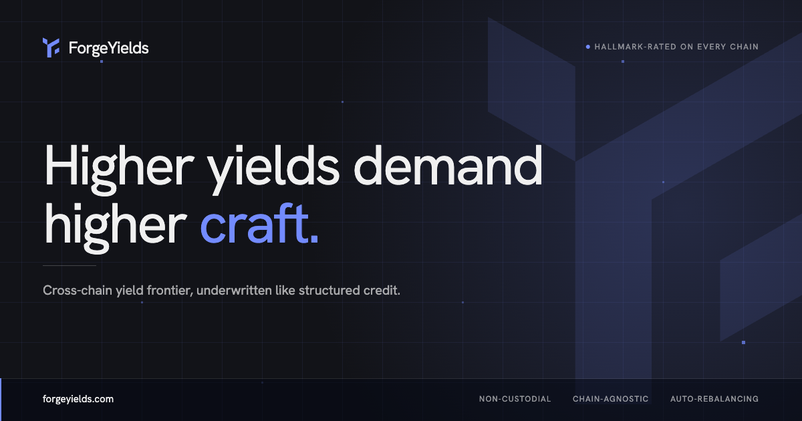
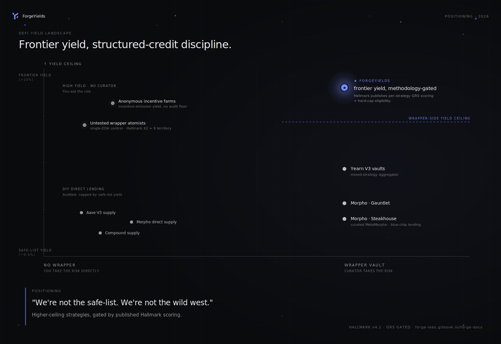

# 🖖 Introduction

**Higher yields demand higher craft.**

ForgeYields is a cross-chain yield aggregator for the frontier — strategies blue-chip aggregators won't touch, underwritten like structured credit.

<figure><figcaption></figcaption></figure>

## Why ForgeYields

Yield aggregators give you safe-list returns. Anonymous farms ask you to take their word for it.

ForgeYields gives you the frontier — with the discipline of structured credit. Tracking dozens of protocols. Rebalancing across chains as incentives shift. Underwriting every position before deposit. That's a full-time job — ForgeYields runs all of it for you, continuously, on-chain.

<figure><figcaption>Where ForgeYields sits in the landscape. Same wrapper-level discipline as Yearn / Morpho-curated, but Hallmark's published methodology lets us safely include the frontier strategies the others won't.</figcaption></figure>

## What you get

* **Diversified frontier yields** — selected and rebalanced across chains.
* **Underwritten by [Hallmark](hallmark/overview.md)** — every strategy passes a quantitative bar before deposit.
* **Non-custodial** — you hold [fyTokens](basics/fytokens.md); relayers act through an [on-chain Merkle-validated allow-list](how-it-works/overall.md).
* **Verifiable** — every score is [published](hallmark/transparency.md), every allocation logged in real-time [Atomic Reports](basics/yield-allocation.md).
* **No lockups** — mint once, auto-compound, redeem on demand.
* **Clear performance** — live [Projected vs Realized yield](basics/performance-tracking.md) tracking.

## Built for

DeFi users — retail and institutional — who want real yield without the manual work. If you'd rather hold a yield-bearing token than rebalance positions across half a dozen chains, this is for you.

## Where to start

* **Understand the system** → [How it works](how-it-works/overall.md)
* **Read the methodology** → [Hallmark — Overview](hallmark/overview.md)
* **See a worked score** → [How a score is built](hallmark/example-score.md)
* **Start depositing** → [Connect to Forge](user-guide/connect-to-forge.md)
