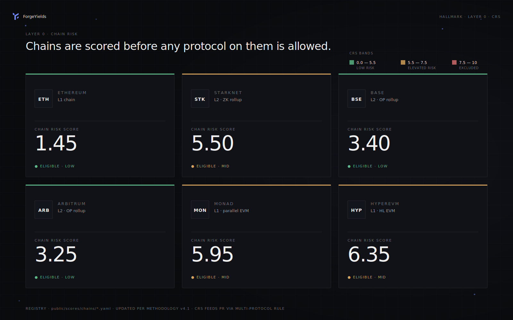

# ⛓ Chains

Hallmark scores every chain ForgeYields deploys to before any protocol on it is allowed. Chain risk feeds into Protocol Risk via the Multi-Protocol Rule — a strategy on Morpho-Ethereum and a strategy on Morpho-Monad are scored differently because the underlying chains carry different risk.

<figure><figcaption>Current Hallmark-rated chains and their Chain Risk Scores (CRS), per methodology v4.2.</figcaption></figure>

## The CRS rubric (N1–N5)

Each chain is scored on five N-criteria:

| # | Criterion | What it measures |
|---|---|---|
| **N1** | Consensus & Decentralization | Validator count, client diversity, finality mechanism, super-majority risk |
| **N2** | Sequencer Architecture | L1 (no sequencer) vs L2 sequencer model — centralized, decentralized, escape hatches |
| **N3** | Operational Track Record | Years live, sustained chain halts, recovery patterns |
| **N4** | Bridge Architecture | Native canonical bridge security model for cross-chain operations |
| **N5** | VM Maturity | Years of production code, formal semantics, audit chain on VM upgrades |

## How CRS connects to strategy GRS

Chain risk doesn't get its own slot in the GRS formula. Instead, it **feeds into Protocol Risk** via the Multi-Protocol Rule (MPR):

```
ProtocolRisk = max(P_i) + (N-1) × 0.20 × mean(P_i)
```

Where the chain enters as one of the `P_i` values. This means:
- Strategies on chains with low CRS (Ethereum 1.45) carry minimal chain-risk contribution
- Strategies on chains with elevated CRS (Monad 5.95) inherit measurable additional risk
- Multi-protocol strategies on multiple chains compound both protocol AND chain dimensions

## Re-scoring cadence

Chains are re-evaluated:
- **Quarterly** baseline (full N1–N5 re-score)
- **Event-driven** on material incidents — chain halt, sequencer failure, bridge exploit, governance change

See [Transparency & Public Scores](transparency.md) for how to verify any CRS yourself from the public feed at `forge-hallmark/scores/chains/*.yaml`.
