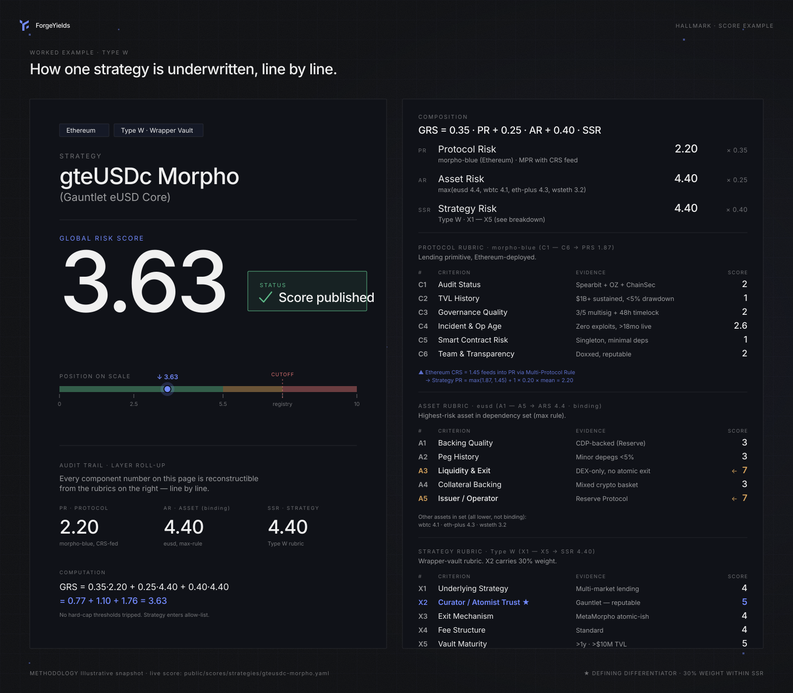

# 🔍 How a score is built — gteUSDc Morpho

This is a worked example: one strategy, every number, the evidence behind each criterion, and how it composes into the final GRS. If you read this end-to-end, you'll know how to verify any other Hallmark score yourself.

> **Illustrative values.** The scores, weights, and dates below are a frozen snapshot from the assessment this walkthrough was written against. Live scores — and the current methodology version — are in the [public registry](https://github.com/ForgeYields/forge-hallmark); the strategy YAML is always the canonical number.

<figure><figcaption>One strategy, every number, line by line. Every value in the composition is reconstructible from the criteria below — no black boxes.</figcaption></figure>

***

## The strategy

**Name:** gteUSDc Morpho (Gauntlet eUSD Core)\
**Chain:** Ethereum\
**Type:** W (Wrapper Vault)\
**Vault target:** fyUSDC\
**Methodology version:** v4.1\
**Assessment date:** 2026-05-18

Source: [`forge-hallmark/scores/strategies/gteusdc-morpho.yaml`](https://github.com/ForgeYields/forge-hallmark/blob/main/scores/strategies/gteusdc-morpho.yaml)

This is a [Type W (Wrapper Vault)](methodology.md#type-w--wrapper-vault-v41) strategy: ForgeYields deposits into Gauntlet's curated MetaMorpho vault, which in turn deploys to a set of Morpho Blue markets. We don't execute the underlying lending strategy ourselves — Gauntlet does. That two-layer trust model is precisely what Type W exists to score.

***

## The four numbers

```
GRS              =  3.63    ← composite, on the 1–10 scale
├── PR (Protocol)   =  2.2  ← weighted 0.35
├── AR (Asset)      =  4.4  ← weighted 0.25
└── SSR (Strategy)  =  4.40 ← weighted 0.40
```

These four numbers — plus the sub-scores and classification labels behind them — are the complete Hallmark output for this strategy. Hallmark stops here: no verdict, no cap, no eligibility flag. What happens next is a policy question, and we walk through it at the end of this page.

***

## Layer 1 — Protocol Risk (PR = 2.2)

Type W strategies inherit protocol risk from the **wrapper protocol** (Morpho via MetaMorpho), computed via the Multi-Protocol Rule across dependencies.

**Dependencies (from the YAML):**
- `morpho-blue` (the lending primitive)

**Morpho Blue's L1 scores** ([source](https://github.com/ForgeYields/forge-hallmark/blob/main/scores/protocols/morpho-blue.yaml)):

| Criterion | Weight | Score | Evidence |
|---|---|---|---|
| **C1** Audit Status | 25% | 2 | Spearbit + OpenZeppelin + ChainSecurity audits, findings resolved |
| **C2** TVL History | 10% | 1 | TVL > $1B sustained, 30d drawdown < 5% |
| **C3** Governance Quality | 20% | 3 | 3/5 multisig + 48h timelock on upgrades |
| **C4** Incident History & Op Age | 20% | 2 | Zero exploits, > 18mo operational |
| **C5** Smart Contract Risk | 15% | 3 | Singleton architecture, minimal external deps |
| **C6** Team & Transparency | 10% | 2 | Doxxed team, public roadmap, regular comms |

**Morpho Blue PR** = 0.25·2 + 0.10·1 + 0.20·3 + 0.20·2 + 0.15·3 + 0.10·2 = **2.2**

With only one protocol dependency, the Multi-Protocol Rule reduces to `max(scores) = 2.2`.

***

## Layer 2 — Asset Risk (AR = 4.4)

Asset risk is the **max** across the strategy's asset dependencies — using the riskiest asset, not an average. This prevents diluting risk by holding many small risky positions.

**Dependencies (from the YAML):**
- `eusd` (Reservoir USD — the deposit asset)
- `wbtc` (held in some Gauntlet Core markets)
- `eth-plus` (LST basket)
- `wsteth` (Lido stETH wrapper)

**Asset scores** (each computed under the L2 rubric):

| Asset | ARS | Notes |
|---|---|---|
| `eusd` | 4.4 | A1=5 (CDP backing), A2=4 (depeg history minor), A3=5 (DEX-only exit), A4=4 (mixed collateral), A5=4 (mcap $50-200M) |
| `wbtc` | 2.8 | A1=3, A2=2, A3=2, A4=4 (BitGo custody), A5=2 |
| `eth-plus` | 3.8 | Index of LSTs, A4=4 |
| `wsteth` | 3.2 | Strong LST, A3=3 (async exit) |

**AR for this strategy** = max(4.4, 2.8, 3.8, 3.2) = **4.4** (dominated by eUSD)

The eUSD score is the constraint here. If Reservoir loses peg or backing degrades, AR would update and cascade into the strategy's GRS.

***

## Layer 3 — Strategy-Specific Risk (SSR = 4.40)

This is where Type W's X1–X5 rubric applies. Each criterion is scored 0–10, weighted, and summed.

| # | Criterion | Weight | Score | Evidence |
|---|---|---|---|---|
| **X1** | Underlying Strategy Risk | 25% | 4 | MetaMorpho deploys to multi-market Morpho Blue lending. Lending is well-understood; risk is conventional. |
| **X2** | Curator/Atomist Trust | 30% | 5 | **Gauntlet** is the curator — reputable risk-management firm, public team, track record on Aave/Compound. Curator changes vault allocations within published parameters. |
| **X3** | Exit Mechanism | 20% | 4 | MetaMorpho atomic-ish withdrawal: borrowers may delay full atomic exit if utilization is high, but standard cases settle in-block. |
| **X4** | Fee Structure | 15% | 4 | Standard MetaMorpho fees: performance fee published, no unilateral change path within timelock. |
| **X5** | Vault Maturity | 10% | 5 | Live > 1 year, TVL > $10M, no incidents. |

**SSR** = 0.25·4 + 0.30·5 + 0.20·4 + 0.15·4 + 0.10·5
= 1.00 + 1.50 + 0.80 + 0.60 + 0.50
= **4.40**

X2 (Curator/Atomist Trust) is doing the heavy lifting at 30% weight — and Gauntlet's reputation lands it at a 5. If the curator were a single EOA (X2=9 rubric cap), this strategy's SSR would collapse upward and the GRS with it — high enough that any reasonable allocator policy would refuse it. **That's the whole point of Type W weighting X2 heaviest.**

***

## Composite GRS

```
GRS = 0.35·PR + 0.25·AR + 0.40·SSR
    = 0.35·2.2 + 0.25·4.4 + 0.40·4.40
    = 0.77   + 1.10   + 1.76
    = 3.63
```

That's the end of the scoring step. The output is **GRS 3.63** plus the sub-scores and labels above — a measurement, published to the public feed. Hallmark emits no verdict.

***

## Second step — what ForgeYields' Policy derives from it

*Everything below this line is policy-side, not Hallmark.* ForgeYields' public [Allocator Policy](allocator-policy.md) consumes the scores above and derives the deployment decision:

- **Verdict: APPROVED.** The composite scores sit below the Policy's exclusion thresholds, and none of the non-compensable hard triggers (governance, audit, incident-history criteria) fire on the sub-scores.
- **Cap-band:** each score band maps to an allocation ceiling; low-band scores like these land in the widest cap-bands, and the Policy's venue and cluster ceilings still bound the position regardless of score. The current threshold and cap-band tables live in the [Policy](allocator-policy.md) and its machine-readable JSON.
- **Cadence:** the band also sets how often the position is re-scored, and material events force an immediate re-score ahead of cadence.

A different allocator consuming these same scores under a more conservative policy could size this position differently — or refuse it. That's the point of the split: the measurement is universal, the decision is per-allocator.

***

## What would change this score

The Hallmark score is *not static*. Specific events that would trigger a rescore:

| Trigger | Likely impact |
|---|---|
| Morpho Blue exploit or governance change | C3/C4 spike → PR up → GRS up |
| Reservoir eUSD depeg | A2 spike → AR up → GRS up |
| Gauntlet announces single-EOA migration | **X2 → 9 rubric cap → SSR collapses upward → GRS spikes; the Policy would then derive an EXCLUDED verdict from the new scores** |
| MetaMorpho introduces unilateral fee change | X4 spike → SSR up |
| New audit on Morpho Blue with critical findings | C1 spike → PR up |

The cascade integrity validator ensures that if any of these trigger a Layer 1 or Layer 2 rescore, this strategy's GRS will be recomputed automatically.

***

## Verify it yourself

1. Pull the strategy YAML: [gteusdc-morpho.yaml](https://github.com/ForgeYields/forge-hallmark/blob/main/scores/strategies/gteusdc-morpho.yaml)
2. Pull the protocol YAML: [morpho-blue.yaml](https://github.com/ForgeYields/forge-hallmark/blob/main/scores/protocols/morpho-blue.yaml)
3. Pull the asset YAMLs from `scores/assets/`
4. Apply the formulas above using the published weights in [methodology.md](methodology.md)
5. Your number should equal `grs` in the strategy YAML, within ±0.05 (the `check-drift.js` validator tolerance)

If your number differs by more than 0.05, that's a finding — open an issue.

***

## Why pick this example

gteUSDc Morpho was chosen for the walkthrough because it exercises every part of the methodology:
- Multi-asset dependencies (4 assets, max rule applies)
- Single-protocol dependency (Multi-Protocol Rule reduces to identity)
- Type W rubric (X1–X5, the v4.1 addition)
- Reputable but not perfect curator (X2 = 5, neither cap nor floor)
- A clean, unambiguous score profile (low band, no edge case)

For an example of a strategy at the **other end**, see [ipsrBTC Ipor Fusion](https://github.com/ForgeYields/forge-hallmark/blob/main/scores/strategies/ipsrbtc-ipor-fusion-ethereum.yaml) (illustrative snapshot — GRS 9.62): Reservoir Protocol's single-EOA admin (C3 = 9) cascades down, and the Ipor Atomist is also single-EOA (X2 = 9). Hallmark still publishes the fully-computed score — that's deliberate, so any policy can see exactly how far a strategy is from clearing — and ForgeYields' Policy derives EXCLUDED from it on two independent triggers. The strategy never reaches a vault.
