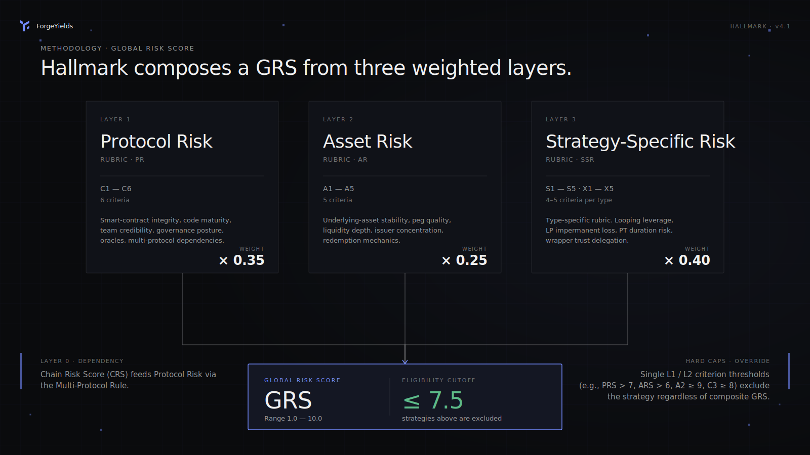
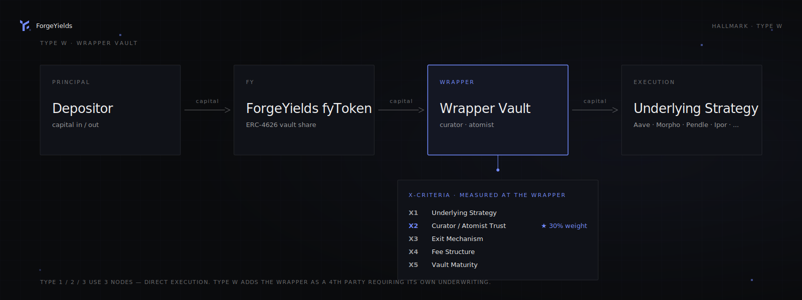

# Methodology

Hallmark is the underwriting framework behind every ForgeYields allocation. It scores risk in **three layers** — each a self-contained rubric — that compose into a single Global Risk Score per strategy.

<figure><figcaption>How the three layers compose into a Global Risk Score. Hard-cap thresholds on any single criterion can exclude a strategy regardless of composite GRS.</figcaption></figure>

## The three layers

| Layer | Scope | Output |
|---|---|---|
| **Layer 1 — Protocol** | Per-protocol assessment (Aave, Morpho, Curve, Pendle…) | Protocol Risk Score (1–10) |
| **Layer 2 — Asset** | Per-asset assessment (USDC, wstETH, sUSDe, PT-tokens…) | Asset Risk Score (1–10) |
| **Layer 3 — Strategy** | Per-strategy composite (the actual deployable position) | Global Risk Score (1–10) |

**Scoring convention:** 1 = lowest risk, 10 = highest risk. **Eligibility cutoff: GRS ≤ 7.5.**

---

## Layer 1 — Protocol Risk

Six weighted criteria assess the systemic risk of each protocol ForgeYields interacts with.

| # | Criterion | Weight | What it measures |
|---|---|---|---|
| **C1** | Audit Status | 25% | Audit count, auditor tier, recency, unaudited code delta |
| **C2** | TVL History | 10% | Absolute TVL, 30d drawdown, ATH distance |
| **C3** | Governance Quality | 20% | Multisig configuration, timelock duration, upgrade controls, custody mode |
| **C4** | Incident History & Operational Age | 20% | Past exploits, loss magnitude, response, operational track record |
| **C5** | Smart Contract Risk | 15% | Code complexity, external dependencies, upgradeability pattern, off-chain dependence |
| **C6** | Team & Transparency | 10% | Doxxing status, public reputation, communication consistency |

**Formula:** `PR = 0.25·C1 + 0.10·C2 + 0.20·C3 + 0.20·C4 + 0.15·C5 + 0.10·C6`

### Notable refinements

- **Type A vs Type B contracts (C1):** Immutable-core protocols are not penalized for audit age — only audit quality and unaudited code delta matter. Upgradeable-core protocols face the full recency rubric.
- **Custody Mode Recognition (C3):** MPC threshold-signature setups are treated distinctly from plain multisigs and EOAs, reflecting their operational security profile.
- **Off-chain dependence (C5):** Protocols relying on CEX accounts for delta-hedging or cloud services for core operations score a minimum of 7 — these counterparty/operational risks are not mitigated by smart-contract audits.

### Chain Risk (CRS)

Chain-level risk (Ethereum, Starknet, Monad, etc.) is scored separately from protocol risk using the **N-criteria rubric** and published as `Chain Risk Score (CRS)`. Per-chain protocol re-deployments inherit chain risk but are not treated as new protocols.

---

## Layer 2 — Asset Risk

Each asset (stablecoin, LST, LRT, wrapped asset) is scored on backing, peg behavior, and redemption mechanics.

| # | Criterion | What it measures |
|---|---|---|
| **A1** | Backing Quality | Collateral type, attestation cadence, transparency |
| **A2** | Peg History | Historical deviation magnitude and recovery time |
| **A3** | Liquidity & Exit | Onchain liquidity depth, async exit credit (queue/cooldown), redemption guarantees |
| **A4** | Collateral Backing | Bridge risk, custody assumptions, dependency on canonical bridges |
| **A5** | Issuer/Operator | Counterparty risk of the issuer or operator |

**Async exit credit (v3.7):** Assets with built-in async redemption queues receive partial credit on A3 even when onchain liquidity is thin, provided the queue is honored and bounded.

---

## Layer 3 — Strategy Risk

Layer 3 combines protocol and asset risk with strategy-specific factors to produce the **Global Risk Score (GRS)** used for eligibility.

**Formula:** `GRS = PR × 0.35 + AR × 0.25 + SSR × 0.40`

Where **SSR (Strategy-Specific Risk)** is computed from rubric-specific criteria depending on strategy type.

### Strategy types

| Type | Description | Rubric |
|---|---|---|
| **Type 1** | Looping / leveraged lending (e.g. wstETH/WETH looper on Aave) | S1–S5 |
| **Type 2A** | Pendle LP (PT/YT split) | S1–S5 |
| **Type 2B** | Curve/Balancer LP | S1–S5 |
| **Type 2C** | Concentrated liquidity LP (Uniswap v3, Ekubo) | S1–S5 |
| **Type 3** | Direct lending / non-looped supply | S1–S5 |
| **Type W** | **Wrapper Vault** (Ipor Fusion, MetaMorpho, Yearn V3, ERC-4626 wrappers) | X1–X5 |

### Type W — Wrapper Vault (v4.1)

Type W exists because depositing into a third-party permissioned vault introduces a **two-layer trust model** that Types 1/2/3 don't cleanly capture. When ForgeYields directly executes a strategy, all risk lives at L1 + L2 + strategy mechanics. When ForgeYields deposits into a vault that internally executes a strategy, the **curator/atomist, exit queue, fee structure, and vault maturity** become first-order concerns.

<figure><figcaption>Type W adds a 4th party (the Wrapper Vault) to the capital flow. The X-criteria measure trust at that wrapper layer — X2 (Curator/Atomist Trust) at 30% weight is the defining differentiator.</figcaption></figure>

| Criterion | Weight | What it measures |
|---|---|---|
| **X1** Underlying Strategy Risk | 25% | What the wrapper does economically (looping, LP, lending) — scored as if direct |
| **X2** Curator/Atomist Trust | 30% | Who can move funds. EOA = 9, MPC-attested = 6–8, multisig + timelock = 3–5 |
| **X3** Exit Mechanism | 20% | Atomic = 1–2, queue ≤ 1d = 3–4, queue ≤ 7d = 5–6, queue > 7d or pause history = 7–9 |
| **X4** Fee Structure | 15% | Transparent low = 1–3, standard = 4–5, opaque/high = 6–8, unilateral change = 8–9 |
| **X5** Vault Maturity | 10% | >2y + >$100M = 1–3, >1y + >$10M = 4–5, <1y or <$10M = 6–8, <3 months or recent incident = 8–10 |

### Recursive Strategy Collateral Rule (v3.8)

If a strategy uses another scored strategy or vault token as collateral, the dependency cascades: any score change in the underlying triggers a re-score of the dependent. Hallmark's validators enforce this graph integrity.

---

## Versioning

The methodology is versioned (currently v4.2). Each amendment is a published, dated document with backwards-compatibility notes. All scores reference the methodology version they were computed under, so historical scores remain interpretable even after the rubric evolves.

| Version | Date | Headline change |
|---|---|---|
| v3.5 | 2026-04-23 | C4 max rule |
| v3.6 | 2026-04-23 | C5 cross-chain, C1 audit coverage |
| v3.7 | 2026-05-06 | L2 A3 async exit credit + WATCHLIST band 6.0–6.5 |
| v3.8 | 2026-05-07 | L3 Recursive Strategy Collateral Rule |
| v3.9 | 2026-05-07 | L1 C3 Custody Mode Recognition (MPC) |
| v4.0 | 2026-05-12 | Chain Risk (CRS) as a distinct layer |
| v4.1 | 2026-05-18 | Type W (Wrapper Vault) for Ipor Fusion / MetaMorpho-style vaults |
| v4.2 | 2026-05-22 | L3 procedural: GRS always computed; verdict derived separately (cascade exclusion ≠ skip computation) |
