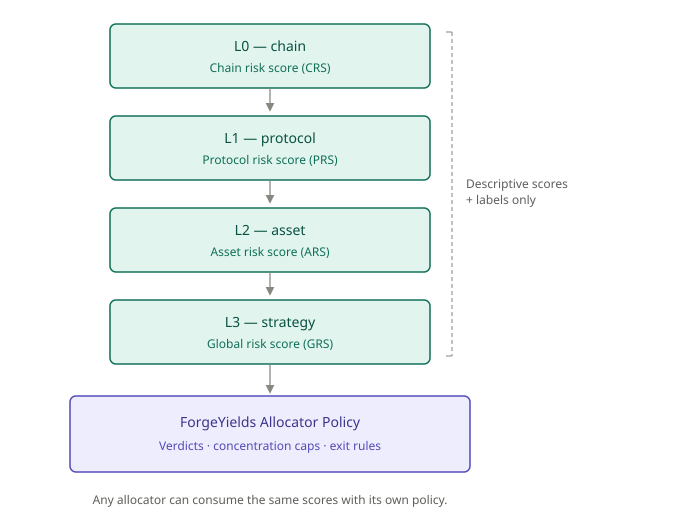

# Methodology

Hallmark is an **open, pure-scoring risk measurement protocol**. It assigns numerical risk scores and classification labels to every chain, protocol, asset, and strategy in scope — and stops there. What a score *means* for a deployment decision is a consumer question, answered by an allocator policy such as the [ForgeYields Allocator Policy](allocator-policy.md), not by Hallmark.

> **Where the numbers live.** This page describes the structure of the methodology. Criterion weights, formulas, and scoring bands are deliberately not duplicated here — the canonical source is the versioned [methodology files](https://github.com/ForgeYields/forge-hallmark/tree/main/methodology) in the public Hallmark repository, which always state the current version. If this page and those files ever diverge, the methodology files win.

<figure><figcaption>The four Hallmark layers produce scores and labels; the Allocator Policy — a separate, public document — turns them into decisions.</figcaption></figure>

## The four layers

Hallmark scores risk in four layers, each a self-contained rubric with published sub-scores:

| Layer | Scope | Output | Sub-scores |
|---|---|---|---|
| **Layer 0 — Chain** | Per-chain assessment (Ethereum, Starknet, Monad…) | Chain Risk Score (CRS, 1–10) | N1–N5 |
| **Layer 1 — Protocol** | Per-protocol assessment (Aave, Morpho, Curve, Pendle…) | Protocol Risk Score (PRS, 1–10) | C1–C6 |
| **Layer 2 — Asset** | Per-asset assessment (USDC, wstETH, sUSDe, PT tokens…) | Asset Risk Score (ARS, 1–10) | A1–A5 |
| **Layer 3 — Strategy** | Per-strategy composite (the actual deployable position) | Global Risk Score (GRS, 1–10) | S1–S5 or X1–X5 |

**Scoring convention:** 1 = lowest risk, 10 = highest risk. Every score is published with its full sub-score breakdown and evidence.

Layer 3 composes the layers below it: the GRS combines a protocol-risk component, an asset-risk component, and a strategy-specific component. Multi-protocol and multi-asset strategies are penalized for compositional complexity, and chain risk enters the protocol-risk component through the same dependency mechanics. The exact weights and composition formulas are stated in the [Layer 3 methodology](https://github.com/ForgeYields/forge-hallmark/blob/main/methodology/layer3_strategy_assessment_methodology.md).

## What each layer measures

**Layer 0 — Chain** ([canonical file](https://github.com/ForgeYields/forge-hallmark/blob/main/methodology/full-framework.md)): consensus and validator decentralization, sequencer architecture, operational track record, bridge/exit security, and VM maturity. Per-chain protocol re-deployments inherit chain risk rather than being treated as new protocols.

**Layer 1 — Protocol** ([canonical file](https://github.com/ForgeYields/forge-hallmark/blob/main/methodology/layer1_protocol_assessment_methodology.md)):

| Criterion | What it measures |
|---|---|
| **C1** Audit status | Audit count and tier, findings resolution, unaudited code delta; immutable-core protocols are not penalized for audit age |
| **C2** TVL history | Absolute TVL, drawdown, distance from highs |
| **C3** Governance quality | Multisig configuration, timelocks, upgrade controls, custody mode |
| **C4** Incident history & operational age | Past exploits, loss magnitude, remediation quality, track record |
| **C5** Smart contract risk | Complexity, dependencies, cross-chain configuration, off-chain reliance, known exploit lineages |
| **C6** Team & transparency | Doxxing status, track record, communication consistency |

**Layer 2 — Asset** ([canonical file](https://github.com/ForgeYields/forge-hallmark/blob/main/methodology/layer2_asset_assessment_methodology.md)):

| Criterion | What it measures |
|---|---|
| **A1** Peg mechanism | Type, robustness, and mutability of the peg/value mechanism |
| **A2** Depeg history | Historical deviation magnitude, duration, frequency |
| **A3** Liquidity depth | DEX/CEX depth at institutional size, redemption-path reality, exit constraints |
| **A4** Collateral backing | Reserve composition after look-through, attestation quality, custody model, backing counterparties |
| **A5** Market cap / supply concentration | Size and holder concentration, with a bounded structural-holder carve-out |

Assets that wrap or derive from other assets are assessed on their **ultimate** backing after look-through — a wrapper hop never launders the risk of what sits underneath. Yield-bearing stablecoins, LSTs/LRTs, RWA tokens, and wrappers additionally require a Layer 1 assessment of their issuing protocol.

**Layer 3 — Strategy** ([canonical file](https://github.com/ForgeYields/forge-hallmark/blob/main/methodology/layer3_strategy_assessment_methodology.md)): each strategy type has its own S-criteria rubric — looping (Type 1), classic AMM LP (Type 2A), Pendle LP (Type 2B), Pendle PT (Type 2C), and direct lending (Type 3). Wrapper-vault strategies (Type W) use the X-criteria rubric instead, measuring the wrapper layer itself: underlying strategy risk, curator/atomist custody, exit mechanism, fee structure, and vault maturity. Strategies that use another scored strategy or vault token as collateral trigger recursive scoring rules, and any score change in an underlying propagates to every dependent.

## Classification labels

Scores compress; labels preserve the facts a consumer policy needs to act on. Alongside every score, Hallmark publishes descriptive classification labels in the score YAML — the current label set includes:

| Label | The question it answers |
|---|---|
| `custody_tier` (A / B / B+ / C) | Who can move funds — plain key, attested MPC, regulated public custodian, or timelocked multisig? |
| `upgradeability` (A / B / mixed) | Is the deployed core immutable or upgradeable? |
| `rwa_class` (T / C / I) | What backs an RWA asset — sovereign debt, corporate credit, or insurance risk? |
| `tranche_position` | Senior or junior in the waterfall? |
| `endogenous_backing` | Is the asset predominantly backed by a reflexive claim on its own issuer's system, after look-through? |
| `redemption_terms_mutable` | Can the issuer unilaterally change the redemption *value* of outstanding tokens without a binding timelock? |
| `regime_dependent_yield` | Does the asset's peg or principal depend on the continued profitability of a market-neutral trade? |
| `custody_model` (i / ii / iii) | For wrapped assets — regulated custodian, distributed threshold custody, or operator-controlled? |
| `backing_counterparties` | Where does the backing actually sit, and is each counterparty a custodian or a credit exposure? |
| `implementation_family` / `toolchain` / `ultimate_venues` | What deployed code lineage, compiler, and end venues does the position ultimately depend on? |

Labels are descriptive only. The cap tightenings, cascades, and cadence rules keyed to them are [consumer-policy](allocator-policy.md) concerns.

### The Known-Vector Table

For exploit classes that recur across protocol *lineages* — the same mechanism reimplemented, sometimes in a different language — Hallmark maintains a versioned appendix: the **Known-Vector Table**. Each row records a logic family, its vulnerability class, public post-mortem citations, a quantitative standard mitigation, and an on-chain verification procedure. A protocol matching a row whose mitigation check fails (or cannot be executed) receives the maximum smart-contract-risk band — matching is at mechanism level, so a reimplementation of a vulnerable design counts, while merely sharing a language does not. Rows are added, edited, or retired only through the RFC process below; no assessor may apply an unratified row or skip a ratified one.

## Scoring discipline

- **Every score carries evidence.** Each criterion score is published with its rationale; a score without evidence is not a valid score.
- **Scores are always fully computed.** Every component and composite is published for every subject — including strategies whose dependencies would exclude them under a consumer policy. A cascade never leaves a field blank; measurement and deployment eligibility are separate concerns.
- **Missing data scores conservatively.** A structured missing-data protocol governs what happens when data is unavailable, contradictory, or too young to assess — defaulting to the conservative reading, never to the benefit of the doubt.
- **Private inputs only tighten.** Non-public inputs (NDA disclosures, team interviews) can push a score more conservative, never looser — every score must be reconstructible from public information alone.

## Versioning, amendments, and the RFC process

The methodology is versioned; the current version is always stated at the top of the [canonical methodology files](https://github.com/ForgeYields/forge-hallmark/tree/main/methodology). Every score references the methodology version it was computed under, so historical scores remain interpretable after the rubric evolves.

Changes follow a fixed discipline:

1. **Every change is a dated, published amendment** — see the [amendments directory](https://github.com/ForgeYields/forge-hallmark/tree/main/methodology/amendments) — with rationale, evidence, and backwards-compatibility notes. No silent edits; superseded versions are archived unmodified.
2. **Material changes flow through an RFC-style pipeline:** drafted with incident evidence, adversarially reviewed against the live registry for false-positive damage, then ratified — with named re-scores reviewed individually before publication. Rules that fired on positions they shouldn't have were rewritten or rejected before ratification.
3. **Amendments must pass a standing acceptance test:** a no-hindsight backtest against a suite of historical incidents, including control incidents that no honest ex-ante rule should fire on. An amendment that "catches" the controls is overfitted by definition and does not ship.

## What Hallmark does NOT do

Hallmark publishes measurements, not decisions. It does **not**:

- emit deployment verdicts — there is no "approved" or "excluded" at the scoring layer;
- set eligibility thresholds or score cutoffs;
- set concentration caps, exit timelines, or remediation plans;
- decide reassessment cadences for any allocator's deployment purposes.

All of that lives in the consumer's policy. ForgeYields' own answers — binary verdicts, cap-bands, cascade rules, cadences, and the machine-readable policy file the allocator actually runs — are documented on the [Allocator policy](allocator-policy.md) page. Other institutions consuming the same Hallmark scores can, and are expected to, decide differently.

## Where to go next

- [Allocator policy →](allocator-policy.md) — how ForgeYields turns these scores into deployment decisions
- [How a score is built →](example-score.md) — a worked example, end to end
- [Transparency & public scores →](transparency.md) — the published artifacts and how to verify them
