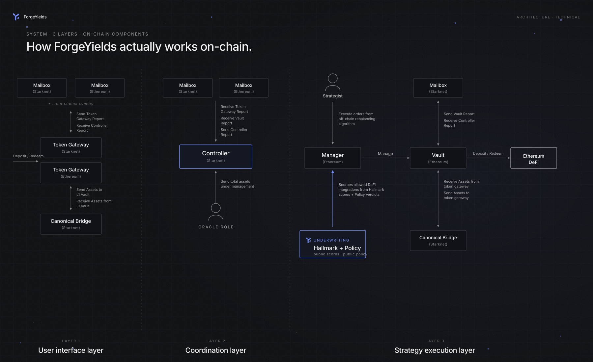
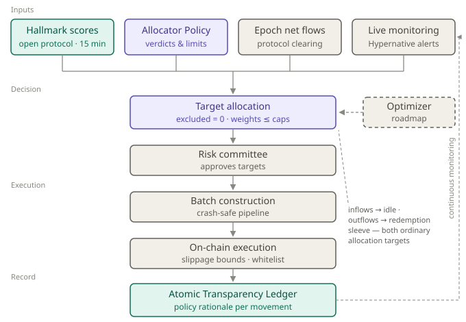

# 🌐 Architecture

<figure><figcaption>How ForgeYields actually works on-chain. Three on-chain layers — User Interface (Token Gateways), Coordination (Controller on Starknet), Strategy Execution (Vault · Manager on Ethereum). The Manager's allow-list is sourced from public Hallmark scores as filtered by the ForgeYields Allocator Policy.</figcaption></figure>

### Architecture Breakdown

#### **1. User Interface Layer (Token Gateways on Each Chain)**

Users interact with ForgeYields through Token Gateways deployed on each supported chain (Starknet, Ethereum, Scroll). These gateways:

* Receive **deposit** and **redeem** requests
* Perform **local netting**
* Handle cross-chain transfers through canonical bridges
* Forward asset flows and reports to the global Controller

This layer abstracts all multi-chain complexity. Users only interact on their chain of choice while the system handles settlement across others.

***

#### **2. Coordination Layer (Controller on Starknet)**

The Controller contract on Starknet is the global coordination hub. It:

* Receives **Token Gateway Reports** (deposit totals, redemption totals)
* Receives **Vault Reports** (executed trades, AUM updates)
* Calculates global AUM and rollup-specific deltas
* Sends back the **Controller Report** to all Token Gateways
* Triggers settlement across chains

This layer also uses an **Oracle Role** that submits off-chain prices, AUM snapshots, and cross-chain state needed to maintain the global epoch logic.

The Controller is intentionally isolated and minimalist, improving auditability and reducing attack surface.

***

#### **3. Underwriting Layer ([Hallmark](../hallmark/overview.md) + [Allocator Policy](../hallmark/allocator-policy.md))**

Before a strategy can enter the Strategist's allow-list, it is scored by Hallmark — the published methodology that scores chain, protocol, asset, and strategy (four layers, including curator/atomist trust for wrapper vaults) on a 1–10 scale. Hallmark publishes descriptive scores and labels only; the ForgeYields [Allocator Policy](../hallmark/allocator-policy.md) derives the verdicts (APPROVED / EXCLUDED), concentration caps, and exit rules from those scores.

* Every score is published and versioned ([forge-hallmark](https://github.com/ForgeYields/forge-hallmark))
* Scores cascade: an L1 protocol rescore triggers re-evaluation of every L3 strategy in its dependency tree
* The allocator refuses any strategy without a current score or without an APPROVED verdict under the Allocator Policy
* No "manual override" path exists — the validators are enforced in the allocator pipeline

This is the gate between "we could deploy here" and "we will deploy here."

***

#### **4. Strategy Execution Layer (Manager + Vault on Ethereum)**

This layer is where eligible capital is allocated and yield is generated.

**Vault (Ethereum, via [Veda Labs BoringVault](https://docs.veda.tech)):**

* Receives assets bridged from Token Gateways
* Deposits into Policy-approved strategies across Aave, Morpho, Curve, Pendle, Ipor Fusion, MetaMorpho, Convex, Yearn V3, and others
* Executes trades and rebalances liquidity
* Sends Vault Reports back to the Controller

**Manager (Ethereum):**

* Enforces the **Merkle-based allowed calls** (set off-chain by the Strategist, gated by the Allocator Policy's APPROVED set)
* Ensures only vetted integrations and methods can be executed
* Acts as the "instruction layer" for strategy changes

**Strategist (Off-chain engine):**

* Computes target allocations across the Policy-approved set — targets are approved by the risk committee before execution
* Allowed actions defined via Merkle roots
* Sends instructions through the Manager to perform swaps, deposits, and reallocations

<figure><figcaption>From scores to movements: every rebalance flows through the same pipeline — inputs → decision → risk-committee approval → crash-safe execution → Atomic Transparency Ledger record with its policy rationale.</figcaption></figure>

***

#### **5. Mailboxes (Hyperlane) Across Chains**

At the top of each layer, Mailboxes (Starknet, Ethereum, Scroll) handle:

* Cross-chain messaging
* Report synchronization
* Controlled dispatch between Token Gateways, Controller, and Vault

This enables a **fully distributed yet unified global state** across all chains.

***

### Summary

This architecture separates ForgeYields into four clean layers:

* **User Interface Layer** → local deposit/redeem, chain abstraction
* **Coordination Layer** → global AUM, epochs, cross-chain state
* **Underwriting Layer (Hallmark + Allocator Policy)** → risk scoring, verdicts and caps, cascade integrity
* **Strategy Execution Layer** → deployment to eligible strategies, allowed calls

Each component has a minimal, clearly defined responsibility, ensuring security, scalability, and fast strategy upgrades.
