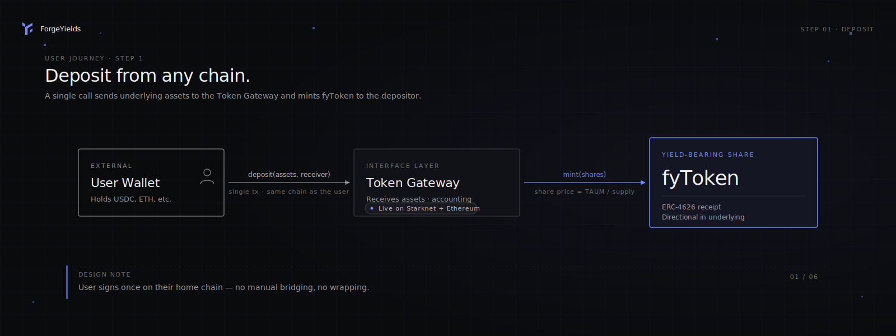
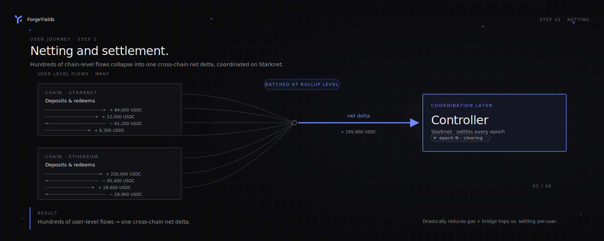
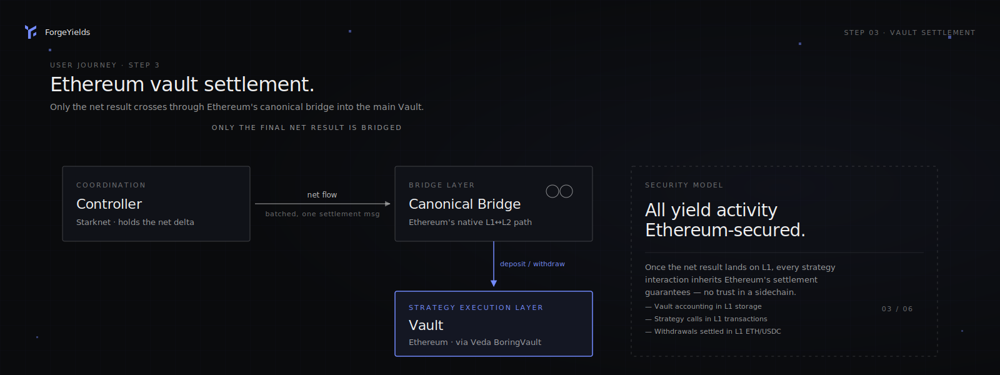
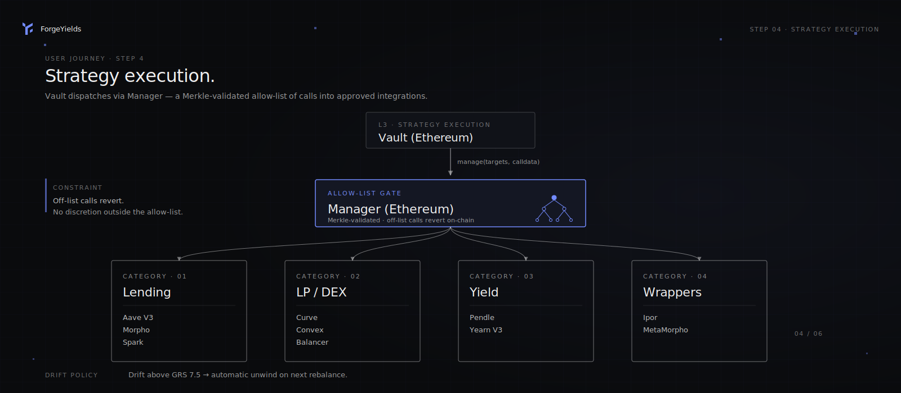
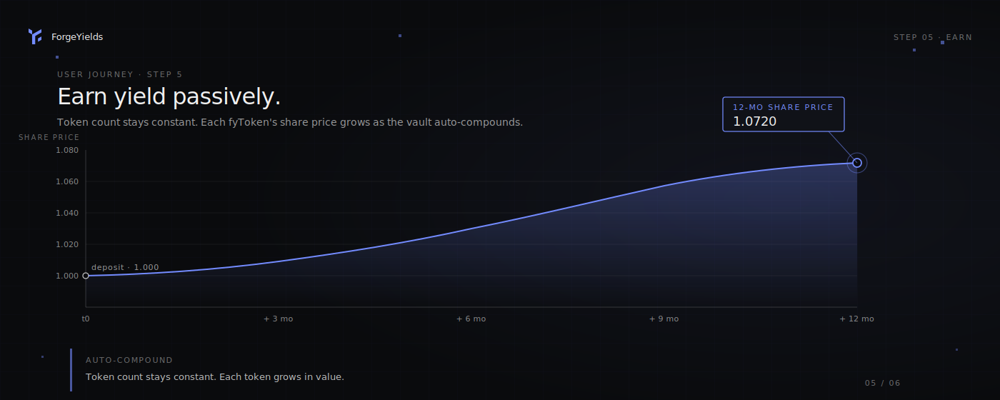
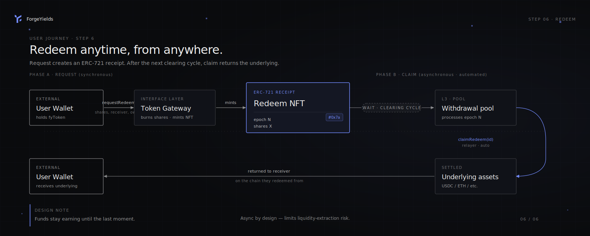

# 🔄 Step by Steps

#### 1. Deposit from Any Chain

Start by depositing your crypto into a ForgeYields strategy from any supported chain. Your assets are pooled in a local buffer with other deposits. In return, you instantly mint a yield-bearing token — your **fyToken**.

<figure><figcaption>User → Token Gateway → fyToken.</figcaption></figure>

#### 2. Netting and Settlement

Deposits and withdrawals are **batched and netted** at the rollup level. Then, all local deltas are globally netted across chains and settled on Ethereum L1. This approach drastically reduces gas usage and avoids unnecessary bridge hops.

<figure><figcaption>Hundreds of user-level flows → one cross-chain net delta.</figcaption></figure>

#### 3. Ethereum Vault Settlement

Only the final net result is processed through Ethereum's canonical bridge. Assets are either deposited into or withdrawn from the main vault, ensuring all yield activity remains Ethereum-secured.

<figure><figcaption>Only the final net result is bridged. All yield activity Ethereum-secured.</figcaption></figure>

#### 4. Strategy Eligibility (Hallmark)

Before any strategy can receive capital, it must clear [Hallmark](../hallmark/overview.md) — ForgeYields' published underwriting framework. Hallmark scores every protocol, asset, chain, and (for wrapper vaults) curator on a 1–10 scale. The composite **Global Risk Score (GRS)** must be ≤ 7.5 for the strategy to enter the allocator's eligible set. Scores are versioned, publicly verifiable, and rescored on material events.

#### 5. Strategy Execution

The allocation engine deploys across the eligible set. All actions are strictly validated against a Merkle-tree whitelist of allowed calls — the relayer cannot deviate from the pre-approved set. If a strategy's GRS later drifts above 7.5, the allocator unwinds the position on the next rebalance.

<figure><figcaption>Vault → Manager → Merkle-validated allow-list → integrations. Off-list calls revert on-chain.</figcaption></figure>

#### 6. Earn Yield Passively

Your **fyToken** grows in value automatically based on the performance of the underlying strategy. Meanwhile, you can freely use the token in DeFi, move it across chains, or explore new ecosystems — all without touching the underlying assets or relying on third-party bridges.

<figure><figcaption>Auto-compounded. Your token count never changes — each token grows in value.</figcaption></figure>

#### 7. Redeem Anytime, from Anywhere

When you're ready, redeem your fyToken on any supported chain. The underlying assets are released once the vault settles liquidity, typically after the next strategy rebalancing.

> 🔁 **Redemptions are asynchronous** — your capital continues earning until the last moment, and the delayed settlement helps reduce exploit risk by limiting direct liquidity exposure.

<figure><figcaption>Async by design — funds stay earning until the last moment. Relayers auto-claim once the request is ready.</figcaption></figure>
