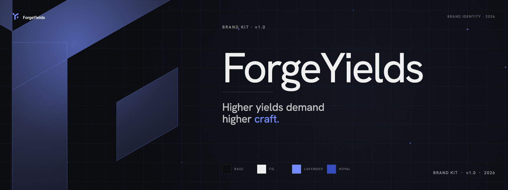
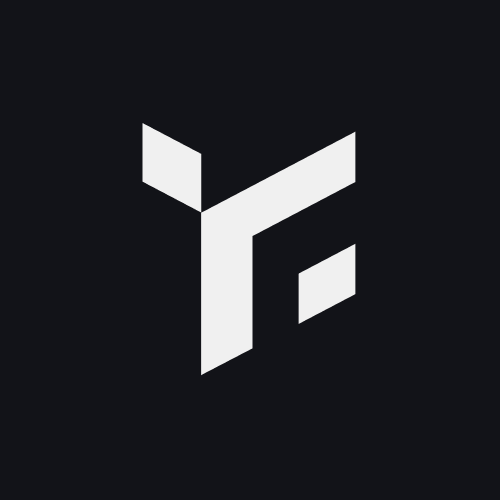
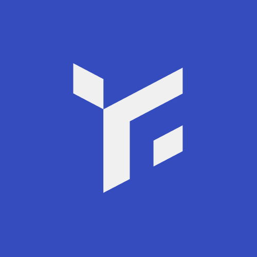
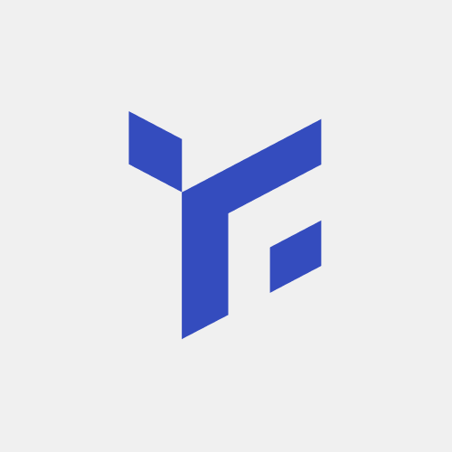
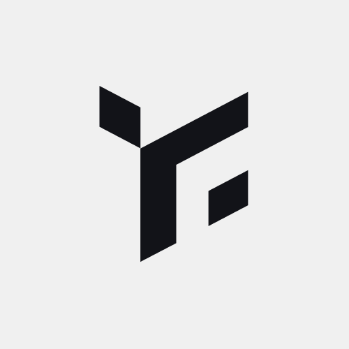
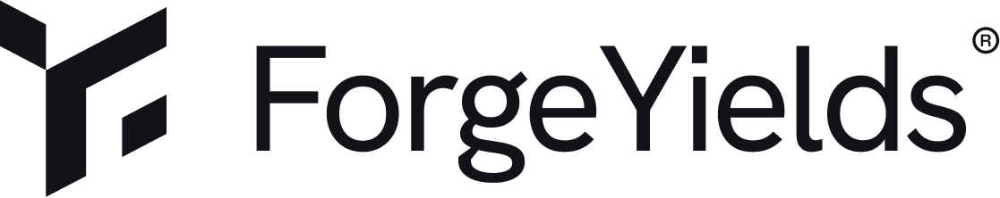
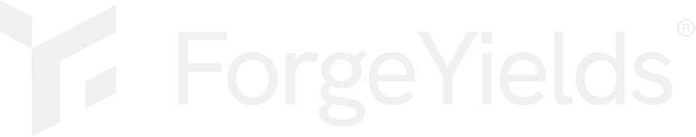

# Brand Kit

<figure><figcaption></figcaption></figure>

## Tagline

> **Higher yields demand higher craft.**\
> Cross-chain yield frontier, underwritten like structured credit.

**Hero / homepage:**
```
Higher yields demand higher craft.
Cross-chain yield frontier, underwritten like structured credit.
```

**Compact / nav:**
```
Higher yields demand higher craft.
```

**Single-line (footer, og:description, Twitter bio):**
```
Higher yields demand higher craft — cross-chain yield frontier, underwritten like structured credit.
```

***

## Voice

ForgeYields speaks like a structured-credit desk, not a retail yield app. Sophisticated, sober, evidence-driven. Lead with the principle, then the product — *"Higher yields demand higher craft"* before *"ForgeYields is…"*.

***

## Color palette

| Token | Hex | Use |
|---|---|---|
| **Background (primary)** | `#0b0c0f` | App + landing background, OG image background |
| **Foreground (primary)** | `#f0f0f0` | Body text, hero copy |
| **Accent (primary)** | `#738BFF` | Numeric callouts (APY, GRS), CTAs, highlights |
| **Theme color** | `#000000` | Browser theme-color meta tag |

Use the accent sparingly — it works because of restraint. A single accent number lands harder than a wall of accent everything.

***

## Typography

**Primary typeface:** [Hanken Grotesk](https://fonts.google.com/specimen/Hanken+Grotesk)
**Body fallback:** Inter

**Type scale:**
| Element | Weight | Tracking |
|---|---|---|
| Hero H1 | 400 (Regular) | -1.38px |
| Subhead | 400 (Regular) | -0.5px |
| Body | 400 | normal |
| Numeric callout (APY, GRS) | 400 | -5% |

Hanken Grotesk is the type system across landing, app, and brand materials. Don't substitute with Inter for headlines — Inter is body-only fallback.

***

## Logos

The wordmark and mark are available in 5 variants — pick by background:

<div><figure><figcaption>Dark background · blue accent</figcaption></figure> <figure><figcaption>Light background · mono</figcaption></figure> <figure><figcaption>Full-color · accent</figcaption></figure> <figure><figcaption>Dark background · white</figcaption></figure> <figure><figcaption>Dark background · mono</figcaption></figure></div>

### Wordmark

<figure><figcaption>Dark background</figcaption></figure>

<figure><figcaption>Light background</figcaption></figure>

### Usage rules

- **Clear space:** keep at least the height of the mark as padding on all sides
- **Don't recolor.** Use the variants provided. The mark is part of the brand, not a customization surface.
- **Don't stretch.** The mark has a defined aspect ratio. Preserve it.
- **Don't combine the mark with other icons or shapes** unless designed by the brand team.

***

## fyToken icons

The three vault tokens each have their own icon:

**fyETH**\
.png>) .png>)

**fyWBTC**\
 .svg>)

**fyUSDC**\
.svg>) 

***

## Assets

For integration partners, full brand assets (logos in all formats, fyToken icons, color tokens, typography spec) are available on request: [forge.fi.contact@gmail.com](mailto:forge.fi.contact@gmail.com).
