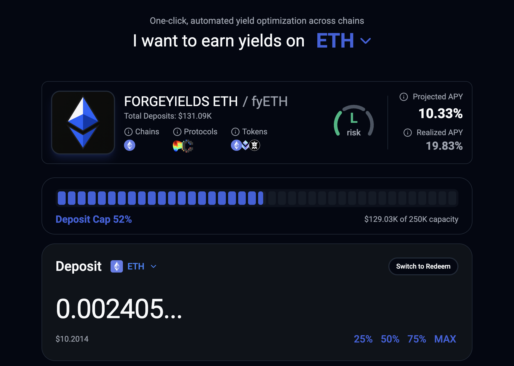

# 💰 Deposit

1.  Select a yield opportunity and enter the amount you want to deposit. 

    <figure><figcaption></figcaption></figure>

2. Take a look at estimated earnings, and click on deposit to start generating rewards. You must sign the transaction in your wallet

<figure><figcaption></figcaption></figure>

3.  You will be notified when the tx is confirmed\
     

    <figure><figcaption></figcaption></figure>

4. You can now access the portfolio section to see current fyTokens holdings

<figure><figcaption></figcaption></figure>
